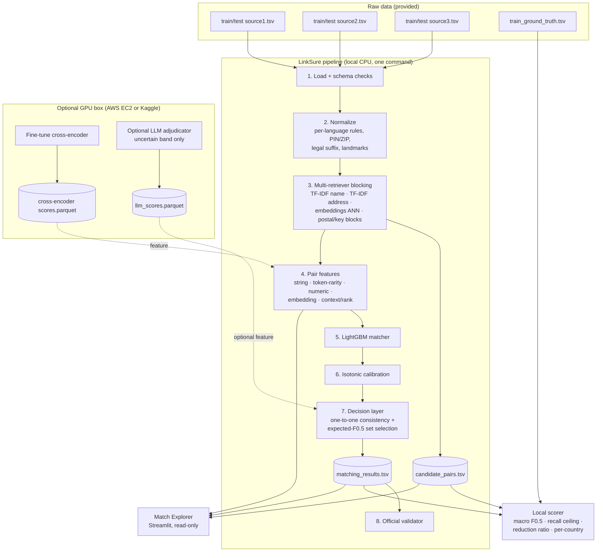
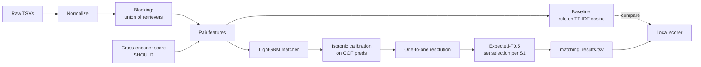
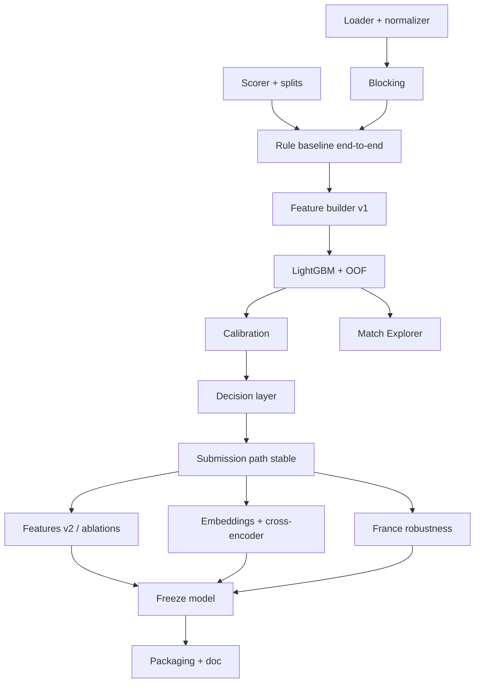

# LinkSure — Precision-First Business Entity Resolution
### Master Build Plan · Amazon ML Challenge: Business Entity Resolution

> **Status:** Planning document. No implementation code yet.
> **Source of truth:** the official problem statement PDF. Anything not in the PDF is marked **[ASSUMPTION]**. Anything we must check in the data before relying on it is marked **[VERIFY]**.

---

## 0. Reality Check: What This Competition Actually Rewards

Before planning, we need to be honest about what gets scored. Your planning template assumes a product with a frontend, a backend and users. The PDF describes something different.

| What the PDF says (FACT) | Implication for the plan |
|---|---|
| Leaderboard is based **only** on `matching_results.tsv`, scored by macro F0.5 | ~80% of effort goes into the ML pipeline. Nothing else moves the rank. |
| Final ranking = **private** leaderboard | Overfitting to the public leaderboard is a real risk. Trust our own validation. |
| Top teams' zip packages are **reviewed and reproduced** | Code must regenerate both TSVs from raw data using only `code/business_entity_resolution/`. Reproducibility is a hard requirement. |
| `candidate_pairs.tsv` is audited for recall ceiling and reduction ratio | Blocking quality is visible to reviewers. It must be the exact set the model scored. |
| Test set contains **France**, which is absent from training | Zero-shot generalization to an unseen country is a hidden core challenge. |
| Model must be MIT/Apache-2.0 and ≤ 8B parameters | This rules out Llama, Gemma, most API LLMs (Claude, GPT), and Bedrock-hosted proprietary models. |
| No external lookups: no geocoding, registries, entity APIs or augmentation | Every normalization rule must be self-written. Everything must be learned from the provided data. |
| Methodology doc must be filled from `Documentation_template.md` | Writing needs real time in the schedule. |

**Not in the PDF:** a live demo, a presentation, judges scoring UX, a deployed app, a database, or authentication.

- **[ASSUMPTION]** There *may* be a finalist presentation. We plan a light, reusable visual tool (§10) that doubles as our error-analysis tool, so it is never wasted work.
- **Decision:** No FastAPI backend, no database, no auth, no React frontend in the MVP. Adding them costs days and earns zero leaderboard points.

### Ambiguities in the PDF (to verify in data or with organizers)

| # | Ambiguity | How we handle it |
|---|---|---|
| A1 | Can one S2/S3 record match **more than one** S1 entity? (S1 is "deduplicated", which suggests no) | **[VERIFY]** in ground truth. If never, enforce a one-to-one assignment constraint. This is a big precision win. |
| A2 | Do matched records always share the same `country` label? | **[VERIFY]**. If yes, restrict blocking within country. If no, block across countries with a penalty feature. |
| A3 | Does the license rule apply only to the "final model" or to every model in the pipeline (embedders, cross-encoders)? | Treat it as applying to **every** model. This is the safe reading. |
| A4 | Are French-language normalization dictionaries (e.g. "bd" → "boulevard", "SARL") "external data"? | **[ASSUMPTION]** Hand-written language rules are domain knowledge, not entity lookup. They are allowed. We document them openly. Never scrape or download lists. |
| A5 | How are public/private test splits made (random S1 entities? by country?) | Unknown. Validate on both random splits and leave-one-country-out. |
| A6 | Daily submission limit on the portal | **[VERIFY]** on the portal. Plan submissions deliberately. |
| A7 | Dataset size | Unknown until download. Plan assumes tens to hundreds of thousands of records, which fits on a laptop. Revise after Phase 1. |

---

## 1. Final Project Direction

### What we build
**LinkSure**: a reproducible, CPU-first entity resolution pipeline. For every Source 1 business, it finds all matching Source 2/Source 3 records. It is tuned specifically to maximize **per-entity macro F0.5**, and it generalizes to an unseen country (France).

### Core objective
Maximize private-leaderboard macro F0.5 while producing an auditable blocking stage and a fully reproducible package.

### Why this approach fits the problem
The metric has three unusual properties that most teams will ignore. Our design targets each one directly.

1. **Macro-averaged per S1 entity.** A tiny S1 with one match counts as much as a large chain. A global pair-level threshold is therefore the *wrong* optimization target. We optimize the decision **per entity**.
2. **Singletons score 1.0 or 0.0.** Deciding "this entity has no match" is a first-class prediction, not a side effect.
3. **β = 0.5.** A false merge costs roughly twice a miss, so the pipeline should be conservative and well-calibrated.

### The three differentiators (what typical teams won't do)
| Differentiator | What it is | Why it matters |
|---|---|---|
| **Expected-F0.5 set selection** | Convert calibrated pair probabilities into the subset (including the empty set) that maximizes *expected* F0.5 for each S1 entity | Directly optimizes the real metric. It handles singletons in a principled way instead of by a hand-tuned threshold. |
| **Global assignment consistency** | Each S2/S3 record is claimed by at most one S1 entity (if A1 verifies), plus mutual-best-match features | Removes a whole class of false merges. |
| **Leave-one-country-out validation + country-agnostic features** | Train on US, validate on India (and the reverse) to simulate France | Most teams will validate on a random split and get surprised by France on the private leaderboard. |

### Minimum successful version (MSV)
- A valid `matching_results.tsv` and `candidate_pairs.tsv` that pass `utils/validate_submission.py`.
- A blocking recall ceiling of ≥ 97% on validation **[target, revise after data]**.
- A LightGBM matcher plus per-entity decision rule that beats the rule-based baseline on held-out F0.5.
- A runnable `code/` folder with README and pinned requirements, plus a filled methodology doc.

Everything else is an improvement on top of the MSV.

---

## 2. System Breakdown

Only components that are genuinely required are included. Rejected components are listed with the reason.

| Component | What it does | Why needed | Technology | Priority |
|---|---|---|---|---|
| **Data loader & validator** | Reads TSVs with `sep="\t"`, checks schema, IDs, prefixes, country values | Silent parsing errors are the #1 PDF warning | pandas | MUST |
| **Normalizer** | Lowercasing, Unicode accent folding, punctuation, legal-suffix and address-abbreviation expansion per language, PIN/ZIP extraction, landmark detection | Removes most noise before any model sees it | Python `re`, `unicodedata` (standard library) | MUST |
| **Blocker (candidate generation)** | For each S1, retrieves a small set of plausible S2/S3 records via several retrievers, then unions them | Sets the recall ceiling. It is audited by reviewers. | scikit-learn TF-IDF (char n-grams), sparse top-k, FAISS for embeddings, key-based blocks | MUST |
| **Pair feature builder** | 40–80 similarity and context features per (S1, candidate) pair | The core signal for the matcher | rapidfuzz, scikit-learn, numpy | MUST |
| **Pair matcher** | Predicts P(match) per pair | The core ML model | LightGBM | MUST |
| **Calibrator** | Makes probabilities trustworthy | Required for expected-F0.5 selection | Isotonic regression (scikit-learn) | MUST |
| **Decision layer** | Assignment consistency plus expected-F0.5 subset selection per S1 | Directly optimizes the metric | numpy (custom) | MUST (simple version) |
| **Local scorer** | Exact macro F0.5 with the singleton rule, plus recall ceiling and reduction ratio | We have no test labels. All decisions depend on this. | Python | MUST |
| **Writer + validator run** | Writes both TSVs and runs the official validator | A failed validation means no score | Python + provided `validate_submission.py` | MUST |
| **Semantic embedder** | Multilingual sentence embeddings for name/address | Catches transliterations and word-order changes that char n-grams miss | `sentence-transformers` + Apache/MIT model | SHOULD |
| **Cross-encoder** | Fine-tuned pair classifier on hard pairs, used as one feature | Strongest accuracy lever after features | Small multilingual transformer, fine-tuned (GPU) | SHOULD |
| **Match Explorer** | Browse any S1 entity, its candidates, probabilities, top feature contributions and the final decision | Our error-analysis tool, and it doubles as a demo | Streamlit reading precomputed files | SHOULD |
| **LLM adjudicator** | Local ≤8B Apache model re-judges only the uncertain probability band | May help French zero-shot | Qwen-family 7–8B Apache model, local | NICE (experiment-gated) |
| **GPU compute** | Runs cross-encoder training and the optional LLM | CPU is too slow for these two things only | One AWS EC2 GPU instance (or Kaggle/Colab) | SHOULD |

**Rejected components:**
- **FastAPI backend.** Nobody calls an API in this competition.
- **Database (Postgres/SQLite).** Parquet files are simpler, faster and reproducible.
- **Authentication.** There are no users.
- **Vector database (Pinecone/Chroma/etc.).** FAISS in-memory is enough, and managed ones add network dependencies.
- **Docker/Kubernetes.** Reviewers need a README and requirements.txt. Docker is optional polish at most.
- **Monitoring.** This is a batch job, so there is nothing to monitor.

---

## 3. Complete Architecture

There is no "user → frontend → backend" chain in the scored system. The real architecture is a **batch pipeline**. The optional Explorer sits beside it and only reads its outputs.



**In plain language:**
1. Read the three source files and clean every name and address into a standard form.
2. For each Source 1 business, quickly shortlist a few dozen likely partners using several cheap search methods. This shortlist is `candidate_pairs.tsv`.
3. For each shortlisted pair, compute dozens of "how similar are they?" numbers.
4. A LightGBM model turns those numbers into a match probability.
5. We make the probabilities honest (calibration). Then, for each Source 1 business, we pick the set of matches that gives the best expected score. That set could be empty.
6. We write the two output files and run the official validator.

The GPU box is a side-car. It produces extra score files that get merged in as features. If it fails, the pipeline still runs without it.

---

## 4. AWS Decision

### Options compared

| | A. Fully local/free | B. AWS-assisted (recommended, minimal) | C. AWS-heavy |
|---|---|---|---|
| **What it looks like** | Laptop for everything. Kaggle/Colab free GPU for fine-tuning. | Laptop for the core pipeline. **One** EC2 GPU instance, switched on only for fine-tuning and LLM experiments. S3 as a backup/transfer bucket. | SageMaker training jobs, SageMaker endpoints, Bedrock, Lambda, managed vector DB |
| **Pros** | Zero cost. Zero AWS learning. Fully reproducible. | Reliable GPU with no session timeouts (Colab disconnects, Kaggle has weekly quotas). Can run a 7–8B model. Transferable resume skill. | Looks "enterprise" |
| **Cons** | Free GPU sessions time out and have quotas. A 7–8B LLM is tight on free T4s. | Must learn EC2 basics. GPU quota request may be needed. Must remember to stop the instance. | Days of learning. Easy to overspend. Bedrock's proprietary models violate the license rule. None of it improves F0.5. |
| **Fit for this challenge** | Good | **Best** | Poor |

### Recommendation: Option B, and only if Phase 2 shows we need a GPU

The core pipeline (TF-IDF, rapidfuzz, LightGBM) runs on a laptop CPU. AWS is only justified for two things:
1. **Fine-tuning a cross-encoder** on training pairs (roughly 1–3 GPU hours per run).
2. **Optionally running a local 7–8B Apache LLM** on the uncertain pairs.

If Kaggle's free GPU works fine for you, AWS is optional. Using it is a convenience, not a requirement.

> **Hard rule:** Do **not** use Amazon Bedrock or any hosted API model for predictions. Hosted proprietary models are not MIT/Apache ≤8B, and reviewers audit this.

### AWS services we would use

| Service | What it does (plain English) | Why we need it | Part of project | Complexity | Costs money? | Covered by $200? | Setup | What to learn |
|---|---|---|---|---|---|---|---|---|
| **IAM** | Controls who can do what in your account | Avoid using the all-powerful root login day-to-day | Account safety | Low | Free | n/a | Create one admin user with MFA | Users, MFA, access keys |
| **AWS Budgets** | Emails you when spending crosses a limit | Protects your credits from a forgotten instance | Cost control | Low | Free for the first couple of budgets **[VERIFY on pricing page]** | n/a | Billing → Budgets → cost budget with alerts | Setting alert thresholds |
| **Service Quotas** | Limits how many GPUs you can launch | New accounts often start with a GPU quota of **0**. You must request an increase. | Unblocks EC2 GPU | Low (but slow) | Free | n/a | Request an increase for "Running On-Demand G and VT instances" | Filing a quota request. **Do this on Day 0: approval can take hours to days.** |
| **EC2 (GPU instance)** | A rented computer with an NVIDIA GPU | Cross-encoder training, optional LLM | GPU side-car | Medium | Yes, hourly while *running* | Yes, easily at our usage | Launch from a Deep Learning AMI, SSH in, run scripts, **stop** when done | Launch, key pairs, security groups, SSH, start/stop vs terminate |
| **EBS** | The hard disk attached to the EC2 instance | Stores OS, model weights, data | GPU side-car | Low (auto-created) | Yes, small, charged even while stopped | Yes | Pick about 100 GB gp3 at launch | That stopped ≠ free, and deleting volumes |
| **S3** | Cloud file storage | Move data/artifacts between laptop and EC2. Back up model checkpoints. | Data transfer, backup | Low | Pennies at our size | Yes | Create one private bucket, use `aws s3 sync` | Buckets, keeping them private, CLI sync |

**Instance choice [VERIFY exact prices in your region on the EC2 pricing page]:**
- `g4dn.xlarge` (NVIDIA T4 16 GB). Roughly $0.5–0.7/hour on-demand. Enough for cross-encoder fine-tuning and a 4-bit quantized 7–8B LLM.
- `g5.xlarge` (NVIDIA A10G 24 GB). Roughly $1–1.3/hour. Use only if we run a 7–8B LLM in higher precision.

**Region:** us-east-1 usually has the best GPU availability. ap-south-1 (Mumbai) has lower latency from Tamil Nadu. Either works. Pick one and keep **everything** in it.

**Credits:** open Billing → Credits and check which services the credits cover and when they expire. Some credits exclude Marketplace products, so prefer the free AWS Deep Learning AMI.

---

## 5. AWS Learning Plan (only what this project needs)

Total learning time: about 3–4 hours spread over Day 0–1.

| Step | Action | Why | Verify |
|---|---|---|---|
| 1 | Log in as root. Enable **MFA** on root. | Stolen root = drained credits | Security credentials page shows MFA active |
| 2 | Billing → **Credits**: note eligible services and expiry date | Know what's covered | You can see the $200 balance |
| 3 | Billing → **Budgets**: create a monthly cost budget of $60 with alerts at 50%, 80%, 100% | Early warning | Test email arrives / budget shows "OK" |
| 4 | **IAM** → create a user `hackathon-admin` with AdministratorAccess, console access and MFA. Log out of root and use this user from now on. | Never work as root | You can log in as the new user |
| 5 | Choose **one region** and pin it in the console top-right | Resources are region-scoped. "My instance disappeared" usually means the wrong region. | Region selector shows your choice |
| 6 | **Service Quotas** → EC2 → "Running On-Demand G and VT instances" → request **8** vCPUs | Unblocks GPU launch. Do this immediately because approval is slow. | Request status is "Pending" or "Approved" |
| 7 | Install **AWS CLI v2** locally. Create an access key for `hackathon-admin`. Run `aws configure`. | Needed for S3 sync from laptop | `aws sts get-caller-identity` prints your account |
| 8 | **S3** → create a private bucket (block all public access ON) and upload one test file with the CLI | Data transfer path | File visible in the console |
| 9 | **EC2** → launch `g4dn.xlarge` from the AWS **Deep Learning AMI (GPU, PyTorch)**. Create a key pair (download the `.pem`). Security group allows SSH **from My IP only**. 100 GB gp3 disk. | Our GPU box | Instance state "running" |
| 10 | SSH in (or use EC2 Instance Connect) and run `nvidia-smi` | Confirms the GPU works | GPU listed |
| 11 | Give the instance S3 access (attach an IAM role with S3 access to the instance) and `aws s3 sync` your bucket down | Get data onto the GPU box without copying secret keys to it | Files appear on the instance |
| 12 | **Stop** the instance. Confirm the state says "stopped". | The most important cost habit | Billing shows no further compute hours |
| 13 | End of hackathon: **terminate** the instance, delete leftover EBS volumes and snapshots, empty and delete the bucket if not needed | Stops storage charges | EC2 and EBS consoles are empty |

**Concepts you can safely ignore for this project:** VPC design, subnets, NAT gateways, load balancers, Lambda, ECS/EKS, SageMaker, CloudFormation/Terraform, Route 53.

---

## 6. Data

| Item | Detail |
|---|---|
| **Datasets** | Only the provided challenge files: `train_source1/2/3.tsv`, `train_ground_truth.tsv`, `test_source1/2/3.tsv` |
| **Source** | Challenge `student_resource` package / portal |
| **Format** | Tab-separated. Columns: `entity_id, business_name, business_address, country`. GT: `source1_entity_id, matched_entity_ids` (comma list, may be empty). |
| **Expected size** | Unknown **[VERIFY in Phase 1]**. Record the row count per file and per country. |
| **Public datasets** | **None.** External data augmentation is prohibited. Do not add public business datasets, gazetteers, or scraped French street lists. |
| **Synthetic data** | Allowed only when generated **from the training data itself** (e.g. applying our own noise functions to training records to create extra hard negatives/positives). Useful for France zero-shot robustness: simulate accent stripping, abbreviation and word-order noise. Treat as a SHOULD and document it clearly. |
| **Real-time data** | Not needed. This is a batch problem. |
| **Pretrained models** | Allowed if MIT/Apache-2.0 and ≤8B. Check the license on every model card and record it in the doc. |

### Cleaning and preprocessing
1. Read with `sep="\t"`, `dtype=str`, `keep_default_na=False`. The last option stops the literal text "NA" from being read as missing (e.g. a business named "NA Traders").
2. Strip whitespace. Collapse repeated spaces. Keep the raw columns alongside the cleaned columns because the Explorer and doc need both.
3. Unicode: NFKD normalize and drop combining marks (é → e) using the standard library. Keep an unfolded copy too.
4. Names: lowercase, `&` → `and`, remove punctuation, expand abbreviations (corp → corporation, pvt → private, ltd → limited, co → company). Also produce a **core name** with legal suffixes removed (US: inc, llc, corp; India: pvt ltd, private limited, llp; France: sarl, sas, sa, eurl, sasu, snc, "et cie"). Detect DBA patterns ("dba", "d/b/a", "trading as", "t/a") and split into two name variants.
5. Addresses: expand abbreviations (rd, st, ave, blvd, nr/opp; French: bd, av, r., pl., chem.). Extract **postal code** (India 6-digit PIN, US 5-digit ZIP ± 4, France 5-digit) as a separate field. Extract **house/unit numbers**. Flag **landmark phrases** ("near", "opp", "behind", "next to", "à côté de", "près de"). Mark city/state tokens by position when possible.
6. Keep `country` as a free string. **Never** one-hot it or filter to {US, India}.

### Train / validation split
- **Unit of splitting: the S1 entity.** All pairs of one S1 go to the same fold. The S2/S3 pool stays complete, like at test time.
- **Split 1: 5-fold random GroupKFold** on S1 entities. This gives out-of-fold (OOF) predictions for calibration and threshold tuning.
- **Split 2: leave-one-country-out.** Train on US → score India, and train on India → score US. This is our proxy for France. Report both.
- **Stratification:** keep the singleton ratio similar across folds.

### Early data questions to answer in Phase 1 (they change the design)
| Question | Changes |
|---|---|
| Does any S2/S3 ID appear in more than one GT row? | Enables or disables the one-to-one constraint (A1) |
| Do matched pairs always share `country`? | Blocking scope (A2) |
| What % of S1 entities are singletons? Per country? | Importance of the empty-set decision |
| Distribution of matches per S1 (0, 1, 2, 5+)? | Max set size in the decision layer |
| Do S2 records ever match S3 records only through S1? Are there S2 duplicates of one entity? | Transitivity features |
| Share of pairs with a postal code on both sides and exact equality? | Strength of postal blocking |
| How often do matched names have **zero** shared tokens (transliteration/DBA)? | Need for embeddings/cross-encoder |

---

## 7. AI/ML Pipeline



### 7.1 Blocking (candidate generation)
Using a union of several cheap retrievers maximizes recall. Each retriever catches a different noise type.

| Retriever | Catches | Settings to tune |
|---|---|---|
| TF-IDF char 3–5-gram on **core name**, cosine top-k | Typos, abbreviations, suffix noise | k ∈ {10, 20, 50} |
| TF-IDF char n-gram on **name + address** | Generic names with distinct addresses | k |
| TF-IDF word-level with IDF on **address** | Reordered components, shared rare street names | k |
| **Postal code + first name token** key block | Strong exact evidence | only if postal present |
| **Acronym key** (initials of core name) | "IBM" ↔ "International Business Machines" | — |
| Embedding ANN (FAISS, cosine) on name+address | Transliteration, word order, semantic DBA | k, SHOULD |

- Scope: within country if A2 verifies. The test country "France" is then just another bucket, with nothing hard-coded.
- **Measure on validation:** recall ceiling (% of true pairs present in candidates), average candidates per S1, reduction ratio = 1 − (candidate pairs / all possible pairs).
- **Target:** recall ceiling ≥ 97% at ≤ 50 candidates per S1 **[revise after data]**. Choose k values by plotting recall vs candidate count.
- The union after a cap (e.g. keep the top N by best retriever score) is written to `candidate_pairs.tsv`. **This must be exactly what the model scores.**

### 7.2 Features (per S1–candidate pair)
All features are **country-agnostic** (similarities, ratios, flags), so they transfer to France.

| Group | Examples |
|---|---|
| Name string | Jaro-Winkler, normalized Levenshtein, token_set_ratio, token_sort_ratio, partial_ratio (rapidfuzz) on raw, normalized and core name |
| Name vector | TF-IDF char cosine, TF-IDF word cosine |
| Name structure | legal suffix equal / conflicting / missing; acronym match; DBA-variant best score; number tokens equal/conflict; length ratio |
| **Token rarity** | Sum of IDF of shared tokens; IDF of the rarest shared token; IDF of the rarest *unshared* token. A shared rare word is strong evidence; "sharma traders" vs "sharma textiles" differ on a meaningful word. |
| Address | token_set_ratio, TF-IDF cosine, shared-token IDF sum |
| Postal | 3-state: both present & equal / both present & different / missing on one side; digit-prefix agreement (nearby area) |
| Numbers | house number equal / conflict / missing |
| Landmark | either side is landmark-style; landmark text overlap |
| Missingness | address missing, address very short |
| Embedding (SHOULD) | cosine of name embeddings, of address embeddings |
| Cross-encoder (SHOULD) | fine-tuned P(match) |
| **Context / rank** | rank of this candidate among the S1's candidates; gap to the S1's best candidate score; **reverse rank**: rank of this S1 among all S1s that retrieved this candidate; mutual-best-match flag; number of candidates for this S1 |
| Source | candidate from S2 or S3 (only if S2/S3 noise differs, **[VERIFY]**) |

Deliberately **excluded**: raw country one-hot, raw text tokens as features. These would overfit to US/India.

### 7.3 Models

| Stage | Model | Why appropriate |
|---|---|---|
| **Baseline** | Rule: match if name TF-IDF cosine ≥ t and postal not conflicting; t tuned on validation | Gives a floor score in hour 3. Every later change must beat it. |
| **Main matcher** | **LightGBM** binary classifier on pair features | Best-in-class for tabular similarity features. Fast on CPU. Gives per-feature contributions for explanations. MIT license. |
| **Hard-negative training** | Train on *blocked candidates* (not random pairs), so negatives are realistic near-misses | Matches the inference distribution |
| **Calibration** | Isotonic regression fit on OOF predictions | Needed for the expected-F0.5 layer to work |
| **Cross-encoder (SHOULD)** | Small multilingual transformer (e.g. a MiniLM-class or `multilingual-e5-small`-class model; **check license on the model card**) fine-tuned on text pairs "name \| address" → match | Learns semantic equivalence the handcrafted features miss. Multilingual pretraining is the best available bet for French. Its score becomes one LightGBM feature, so if it's weak, LightGBM learns to ignore it. |
| **LLM adjudicator (NICE, gated)** | Local Apache-2.0 7–8B instruct model, prompted only for pairs with calibrated p in an uncertain band (e.g. 0.3–0.7) | May help French abbreviations zero-shot. **Only kept if it improves leave-one-country-out F0.5.** Probably slow and possibly noisy. |

**Is fine-tuning necessary?** For LightGBM, training is the whole point. For the cross-encoder, yes: an off-the-shelf model does not know what "same business" means. For the LLM, no. Use it zero-shot or not at all.

**Is an LLM genuinely useful?** Mostly no. It is slow over many pairs, hard to reproduce, and the tabular model will likely beat it on US/India. The *only* credible use is the uncertain band for the unseen country. That is why it is gated behind a measured experiment.

### 7.4 Decision layer (the differentiator)
Pair probabilities are not the final answer. For each S1 we pick the match set.

**Step 1 — One-to-one consistency (if A1 verifies).** If a candidate record is claimed by several S1 entities, keep it only for the S1 with the highest calibrated probability. It is dropped from the others. Optional: require that probability to beat the runner-up by a margin.

**Step 2 — Expected-F0.5 set selection.** For S1 entity *e*, sort candidates by calibrated probability p₁ ≥ p₂ ≥ … and consider predicting the top-k for k = 0, 1, …, K.

Per-entity F0.5 can be written as `F = 1.25·TP / (0.25·|T| + |P|)`, where T is the true set and P the predicted set. When P is empty, F = 1 if T is empty, else 0.

- Expected score of k = 0: the probability that the entity has no true match, ≈ Π(1 − pᵢ) × (1 − r), where r is an estimate of "true match exists outside the candidate set" from validation (the recall-ceiling gap).
- Expected score of k ≥ 1: estimate by sampling (e.g. 500 Monte Carlo draws of which candidates are true, using the pᵢ) and averaging F. It's cheap because each entity has few candidates.
- Pick the k with the highest expected score.

This automatically makes the singleton decision, adapts the number of matches per entity, and is conservative exactly where β = 0.5 wants it to be.

**Step 3 — Compare against simple alternatives on validation:** a global threshold, a per-entity "top-1 if p > t₁, plus extras if p > t₂" rule, and the expected-F0.5 method. **Keep whichever wins on held-out data**, and report the comparison in the methodology doc. This comparison table is itself strong evidence of rigor.

### 7.5 Evaluation metrics
| Metric | Where | Target |
|---|---|---|
| Macro F0.5 (exact PDF definition, singletons included) | Validation, per fold, per country, leave-country-out | Main decision metric |
| Precision / recall (macro) | Validation | Diagnose |
| Singleton accuracy and non-singleton F0.5 separately | Validation | Find which half is losing points |
| Blocking recall ceiling, avg candidates per S1, reduction ratio | Validation | Reported in the doc |
| Calibration (reliability curve, Brier score) | OOF | Needed for the decision layer |
| Public leaderboard F0.5 | Portal | Sanity check only, not the target |

---

## 8. Step-by-Step Development Plan

Each step lists: **Do** (what) · **Why** · **Result** · **Tools** · **Needs** (prerequisites) · **Verify** · **Risk** (what could go wrong).

### PHASE 0 — Environment Setup

**0.1 Read the student_resource package**
- Do: list every file; open `Documentation_template.md` and `utils/validate_submission.py`.
- Why: the template dictates what we must record while building; the validator defines "valid".
- Result: a notes file listing required doc sections.
- Tools: file browser. Needs: downloaded package.
- Verify: you can name every doc section from memory.
- Risk: discovering doc requirements on the last day.

**0.2 Create the GitHub repository (private until the end)**
- Do: create the repo with the structure in §13; add `.gitignore` covering `dataset/`, `artifacts/`, `*.parquet`, `.venv/`, `*.pem`.
- Why: shared work plus a history reviewers can trust.
- Result: empty skeleton pushed.
- Tools: git, GitHub. Verify: teammates can clone.
- Risk: committing the dataset or AWS keys. The `.gitignore` goes in *first*.

**0.3 Python environment**
- Do: Python 3.11 in a venv (or conda). Install pandas, numpy, scikit-learn, lightgbm, rapidfuzz, pyarrow, tqdm, jupyter. Hold off on torch and sentence-transformers until Phase 4.
- Why: a small environment installs fast and fails less.
- Result: `python -c "import lightgbm, rapidfuzz, sklearn"` runs.
- Needs: Python installed. Risk: LightGBM build issues on Windows. Use a pip wheel or conda-forge.

**0.4 Pin versions immediately**
- Do: `pip freeze > requirements.txt`, then trim to direct dependencies with exact versions.
- Why: reproducibility is audited, and pinning late means guessing.
- Verify: a fresh venv installs from the file.

**0.5 AWS safety steps (only the non-optional ones)**
- Do: §5 steps 1–6: MFA, check credits, budget, IAM user, region, **GPU quota request**.
- Why: the quota request is slow, and starting it now costs nothing even if we never use it.
- Verify: quota request shows Pending/Approved. Risk: forgetting it until Phase 4 and waiting a day.

**0.6 Set up a shared experiment log**
- Do: one spreadsheet or markdown table with columns: date, author, change, val F0.5 (random CV), val F0.5 (US→IN), val F0.5 (IN→US), recall ceiling, LB score, notes.
- Why: this becomes the methodology doc's results section, and it stops us fooling ourselves.

### PHASE 1 — Data Understanding

**1.1 Load every file correctly**
- Do: read with `sep="\t", dtype=str, keep_default_na=False`; print shape, columns, and 5 rows per file.
- Why: the PDF explicitly warns about silent single-column reads.
- Verify: 4 columns in each source file, 2 in GT; ID prefixes match the file (S1-/S2-/S3-).
- Risk: embedded tabs or quotes in addresses. Check that the row count equals the line count minus the header.

**1.2 Profile the data**
- Do: rows per file × country; null/empty rate per column; name and address length distributions; 30 random rows per country, read by eye.
- Why: find the noise patterns before designing normalizers.
- Result: a "data notes" page with real examples of each noise type from the PDF list.

**1.3 Answer the design-changing questions** (the table at the end of §6)
- Why: each answer flips a design choice (one-to-one constraint, country scoping, max set size).
- Result: a written yes/no plus numbers for each. Put them in the experiment log.
- Risk: skipping this and building on wrong assumptions.

**1.4 Look at matched pairs side by side**
- Do: print 100 GT matches, grouped into: easy, abbreviation, DBA, transliteration, landmark address, missing postal.
- Why: this directly drives normalizer rules and features.
- Result: a list of the top 10 normalization rules to write, ordered by frequency.

**1.5 Build the splits**
- Do: assign every train S1 entity a fold id (5-fold, stratified by singleton/non-singleton and country) and save it to a file. Also define leave-one-country-out splits.
- Why: every teammate must use identical folds, or the numbers can't be compared.
- Verify: fold sizes roughly equal; singleton ratio similar per fold.

**1.6 Write the local scorer first**
- Do: implement macro F0.5 exactly as the PDF defines it, including singletons (empty/empty = 1.0, any prediction on a singleton = 0.0, empty prediction on a non-singleton = 0.0). Also compute recall ceiling and reduction ratio for a candidate file.
- Why: it's the compass for every later decision.
- Verify: reproduce the PDF example (predicted 3, true 2, 2 correct → 0.714). Scoring GT against itself gives 1.0. An all-empty submission's score equals the singleton fraction.
- Risk: a subtle scorer bug that misleads everything. These three unit tests catch most of it.

**1.7 Produce the "trivial" submissions**
- Do: create an all-empty submission plus an empty candidate file for the test set; run the official validator; upload to the portal if submissions are not scarce.
- Why: tests the full submission path on hour 2, and the all-empty score reveals the test singleton rate (valuable information).
- Verify: validator PASS; portal shows SCORED.

### PHASE 2 — Normalization, Blocking, Baseline

**2.1 Normalizer module**
- Do: implement §6 preprocessing steps 3–5 as pure functions, with per-language rule tables (EN, IN-specific, FR) held in one readable config file.
- Why: pure functions are testable and easy to explain in the doc.
- Verify: unit tests on 30 hand-picked real examples (input → expected output).
- Risk: over-aggressive rules that merge distinct names ("co" inside words). Use word-boundary regex only.

**2.2 Retrievers**
- Do: implement each retriever in §7.1 separately, each returning (s1_id, cand_id, score, retriever_name).
- Why: lets us measure each retriever's unique contribution.
- Verify: on validation, recall ceiling per retriever and for the union.
- Risk: memory blow-up from dense similarity matrices. Always use sparse top-k, processed in chunks of S1 rows.

**2.3 Tune blocking**
- Do: plot recall ceiling vs average candidates per S1 for different k combinations; pick the knee point.
- Result: a blocking config plus numbers for the doc.
- Verify: meets the §7.1 target, or we document why not.

**2.4 Rule baseline end-to-end**
- Do: blocking → rule threshold → per-S1 lists → both TSVs → validator → local score.
- Why: this is the **first real submission**, and it proves the whole path.
- Result: baseline val F0.5 plus a LB score logged.
- Checkpoint: **if this isn't done by about hour 8, stop adding features and fix the pipeline.**

### PHASE 3 — ML Matcher

**3.1 Build the training pair table**
- Do: run blocking on train (per fold, fit the TF-IDF on everything available, since that's also possible at test time with test data); label each candidate pair from GT.
- Verify: positive rate is reasonable; the positives found equal the recall ceiling count.

**3.2 Feature builder v1**
- Do: name-string, name-vector, postal, numbers, missingness features (the cheap ones).
- Verify: no NaN surprises; features are fast to compute (time it on 10k pairs).

**3.3 LightGBM v1 with 5-fold OOF**
- Do: train per fold, predict out-of-fold, then apply a simple global threshold as the decision.
- Verify: val F0.5 > baseline. Check feature importance for sanity (postal-equal and name similarity should rank high).
- Risk: leakage. Features must never use GT or the entity-id numbers. **Check that IDs aren't ordered in a way that leaks matches** (e.g. S1-00001 matching S2-00001). Never use ID numbers as features.

**3.4 Feature builder v2**
- Do: token-rarity, address, landmark, acronym, DBA and legal-suffix features, then context/rank and reverse-rank features.
- Verify: each group is added with a logged ablation (val F0.5 with vs without).

**3.5 Leave-one-country-out check**
- Do: train US-only → score India, and the reverse.
- Why: our France proxy. If the drop is large, find which features are country-specific.
- Result: the "generalization gap" number for the doc.

**3.6 Calibration**
- Do: fit isotonic regression on the OOF probabilities; plot the reliability curve.
- Verify: predicted 0.8 pairs are right about 80% of the time.

**3.7 Decision layer**
- Do: implement one-to-one resolution (if A1 holds), global-threshold, two-threshold, and expected-F0.5 selection; compare all on OOF.
- Result: comparison table in the log; keep the winner.
- Risk: Monte Carlo being slow. Cap K at around 10 and use a vectorized sampler; still cheap.

**3.8 Full train + test inference + submission #2**
- Do: fit on all train, predict test, write TSVs, validate, submit.
- Verify: LB moves in the same direction as validation. If it moves opposite, investigate before trusting either.

### PHASE 4 — GPU Components (only after Phase 3 works)

**4.1 Decide GPU platform**
- Do: try Kaggle notebook GPU first (free). Launch EC2 only if Kaggle quota or timeouts block you, or for the LLM experiment.

**4.2 EC2 setup (if used)**
- Do: §5 steps 7–12. Keep a `gpu_session.md` with launch time and stop time.
- Verify: `nvidia-smi` works; data synced via S3.
- Risk: forgetting to stop. Set a phone alarm every time you start the instance.

**4.3 Embedding retriever and features**
- Do: pick an MIT/Apache multilingual sentence-embedding model; record its license in the doc; encode all names and addresses (this can even run on CPU if data is small); add the FAISS retriever and cosine features.
- Verify: blocking recall gain; val F0.5 gain. Drop it if there is no gain.

**4.4 Cross-encoder fine-tuning**
- Do: training pairs = blocked candidates from training folds (hard negatives), text = "name | address", with 1–3 epochs. Produce OOF cross-encoder scores with the **same folds** (so the LightGBM feature isn't leaked).
- Why: OOF avoids the cross-encoder memorizing training pairs and inflating the LightGBM validation score.
- Verify: cross-encoder alone vs LightGBM alone vs LightGBM + CE feature, on both random and leave-country-out validation.
- Risk: time cost of 5-fold training. Fallback: train on a single split and use it only for test plus one holdout; document the choice.

**4.5 LLM adjudicator experiment (gated, NICE)**
- Do: only if time remains. Pick an Apache-2.0 instruct model ≤8B; confirm the license on the model card; run it locally on the GPU for uncertain-band validation pairs only; use it as a feature or override.
- Keep only if it improves leave-country-out F0.5. Otherwise record "tried, didn't help" in the doc (that's still a legitimate finding).
- Risk: slow throughput; non-deterministic outputs. Use temperature 0 and cache all outputs to a file so reruns are reproducible.

### PHASE 5 — Robustness for France (the hidden test)

**5.1 Inspect the test set's French rows** (no labels, just reading)
- Do: look at 50 French S1 records and their top candidates.
- Why: check that the normalizer handles accents, "rue/bd/av", SARL/SAS, and 5-digit postcodes and CEDEX.
- Result: French rule additions, written from general language knowledge only.
- Allowed: inspecting unlabeled test inputs to fix *parsing* is standard practice. **Not allowed:** hand-labelling test pairs or looking up businesses.

**5.2 Synthetic noise augmentation (SHOULD)**
- Do: generate extra training pairs by applying our noise functions to training records (accent removal, abbreviation swaps, token reordering, typo injection).
- Verify: leave-country-out F0.5 improves or holds.

**5.3 Sanity checks on test predictions**
- Do: compare predicted-match rate per country on test vs train; check that the France rate isn't wildly different.
- Why: a big gap signals the model is failing silently on France.

### PHASE 6 — Packaging and Reproducibility

**6.1 One-command pipeline**
- Do: `python -m src.run --data-dir dataset --out-dir output` runs everything from raw TSVs to both TSVs and runs the validator. GPU steps read cached score files if present and are switchable by a flag.
- Why: reviewers must reproduce the result.
- Verify: fresh clone + fresh venv + one command gives byte-identical (or near-identical) outputs.

**6.2 Determinism**
- Do: fixed seeds for everything; sorted IDs before writing; `deterministic=True` in LightGBM if needed.
- Verify: two runs give the same file hash.

**6.3 README.md**
- Contents: environment setup, data placement, exact commands, runtimes, hardware used, GPU-optional notes, model licenses table.

**6.4 Methodology document**
- Do: fill every section of `Documentation_template.md` from the experiment log. Include the blocking recall table, the ablation table, the decision-layer comparison, the leave-country-out results, and a fair-play statement ("no external data; rule tables hand-written; models and licenses: …").

**6.5 Build the zip**
- Structure exactly as the PDF specifies (§13). Validate the outputs again from inside the unzipped folder.

### PHASE 7 — Testing
| Test | What |
|---|---|
| Unit | Normalizer examples, scorer on PDF example, empty-set cases |
| Pipeline | Tiny sample dataset (e.g. 200 S1s) runs end-to-end in under a minute; run on every major change |
| Output | Official validator on both files; subset check (matches ⊆ candidates) |
| Regression | The experiment log: a change that lowers val F0.5 is reverted |
| Reproducibility | Fresh-clone run before submission |

### PHASE 8 — "Deployment"
There is no server to deploy. "Deployment" here means: (1) the final leaderboard upload, (2) the submission zip, (3) optionally, a public GitHub repo after the competition ends, if the rules allow. **[VERIFY competition rules on sharing code before making it public.]**

### PHASE 9 — Demo / Presentation assets (only if a presentation exists)
- Match Explorer (Streamlit), reading precomputed outputs: pick an S1 → see candidates with probabilities, top feature contributions (LightGBM's built-in per-prediction contributions), and why the decision layer picked that set.
- 5–6 slides: problem → metric insight → pipeline → results table → France generalization → lessons.

---

## 9. Build Order and Dependencies



**Rules:**
1. **Scorer before any model.** Without it, nothing can be judged.
2. **End-to-end ugly before accurate.** A rule baseline that produces valid files beats a clever half-built model.
3. **Blocking is frozen early-ish.** Features and model depend on its output, so changing blocking late means regenerating everything. Tune it in Phase 2; allow only additive retrievers later.
4. **GPU work only after LightGBM works.** The cross-encoder is a feature for LightGBM, not a replacement.
5. **The Explorer can start as soon as the OOF predictions file exists.** It doesn't block anything.

**Cannot be parallelized:** loader → blocking → first training table. Everyone depends on this chain for the first ~6 hours, so put your strongest coder on it and have others build the scorer, normalizer tests and data profiling alongside it.

---

## 10. MVP First

### MUST BUILD
- Correct loader, normalizer, multi-retriever blocking
- Local scorer (exact metric) and fixed folds
- LightGBM matcher with core features + OOF
- Calibration + a decision layer that handles empty sets
- Both TSVs, validator PASS, submission uploaded
- Reproducible one-command pipeline, README, requirements, methodology doc, zip

### SHOULD BUILD
- One-to-one assignment constraint (if A1 verifies)
- Expected-F0.5 set selection
- Token-rarity and reverse-rank features
- Leave-one-country-out validation and France normalizer rules
- Embedding retriever/features
- Fine-tuned cross-encoder feature
- Match Explorer (for error analysis first, demo second)

### WOW FEATURES (memorable, and each one has measurable value)
- **"Metric-aware decisions" chart:** val F0.5 for global threshold vs expected-F0.5 selection, split into singleton vs non-singleton entities.
- **"Unseen-country" results:** the leave-one-country-out table, showing the gap and what closed it.
- **Explorer's "why" panel:** per-pair feature contributions ("postal match +2.1, rare shared token 'Ganapathy' +1.4, suffix conflict −0.6").
- **Blocking efficiency:** "we score X% of possible pairs while keeping Y% of true matches."

### CUT FIRST (in this order)
1. LLM adjudicator
2. Synthetic augmentation
3. Explorer polish (keep a bare table version)
4. 5-fold cross-encoder (fall back to single-split)
5. Embedding retriever (if TF-IDF recall is already ≥97%)

**Never cut:** scorer, validator run, reproducibility, methodology doc.

---

## 11. Hackathon Timeline

**[ASSUMPTION]** The challenge window is a few days, not one continuous 24-hour sprint. The timeline below uses "working hours". Stretch or compress it to match your actual window.

| Period | Must be done by the end |
|---|---|
| **First 2 hours** | Package read; repo + venv + pinned requirements; files loaded correctly; AWS MFA/budget/**GPU quota request** submitted; all-empty test submission passes the validator |
| **First 6 hours** | Data profile + design questions answered (A1, A2, singleton rate); folds saved; scorer with unit tests; normalizer v1; TF-IDF name retriever with measured recall |
| **First 12 hours** | Full blocking union tuned; rule baseline scored locally and on the leaderboard; training pair table built; feature builder v1 |
| **First 24 hours** | LightGBM + OOF + calibration + decision layer; submission #2 beats baseline; features v2 in progress; leave-country-out numbers logged |
| **Final development phase** | Cross-encoder/embeddings (if GPU ready); France rules; decision-layer comparison; ablations; Explorer basic version; methodology doc drafted in parallel |
| **FEATURE FREEZE** | **~8 working hours before the deadline (or at least 12 wall-clock hours if the deadline is at night).** After this: no new features, only bug fixes, reproducibility and writing. |
| **Final 3 hours** | Fresh-clone reproduction run; final outputs regenerated from the frozen code; validator PASS; doc complete; zip built and unzipped-and-checked |
| **Final 1 hour** | Upload final `matching_results.tsv`; upload zip; confirm on the portal; terminate AWS resources; nothing else |

**Final submission choice:** pick the model with the best **validation** score (especially leave-country-out), not necessarily the best public LB score, since the private LB decides.

---

## 12. Team Task Distribution

**[ASSUMPTION]** Team of up to 4. With fewer people, merge tracks C+D, then B+C.

| Person | Track | Owns | Depends on |
|---|---|---|---|
| **A — Data & Blocking** | Loader, normalizer, retrievers, candidate files, France rules | `src/data`, `src/normalize`, `src/blocking` | Nothing (starts immediately) |
| **B — Model** | Features, LightGBM, calibration, ablations | `src/features`, `src/model` | A's first candidate table (~hour 6–10). Before that: build feature functions on hand-made pairs from GT. |
| **C — Evaluation & Decisions** | Scorer, folds, decision layer, validator wrapper, experiment log, leave-country-out | `src/eval`, `src/decide` | Scorer: none. Decision layer: B's OOF probabilities. Before that: build it against fake probabilities. |
| **D — GPU, Packaging & Presentation** | AWS/Kaggle setup, embeddings, cross-encoder, README, doc, zip, Explorer | `src/embed`, `src/crossenc`, `app/`, `docs/` | A's normalized text (for embeddings), C's folds (for OOF cross-encoder) |

**Anti-blocking agreements (settle on hour 1):**
- File contracts: `candidates.parquet` columns `(s1_id, cand_id, retriever, score)`; `features.parquet` = candidates + features; `probs.parquet` = `(s1_id, cand_id, p_raw, p_cal, fold)`.
- Fold file is owned by C and never changed after hour 6.
- Everyone works in their own `src/` subfolder; the single `run.py` is edited only by one person.

---

## 13. Repository Structure

The repo mirrors the required zip layout so packaging is just a copy.

```
linksure/                                 # GitHub repo root
├── dataset/                              # NOT committed (.gitignore) — train/ and test/ TSVs
├── artifacts/                            # NOT committed — parquet caches, models, OOF preds
├── output/
│   ├── matching_results.tsv              # final (committed at the end only)
│   └── candidate_pairs.tsv
├── code/
│   └── business_entity_resolution/
│       ├── src/
│       │   ├── run.py                    # one-command entry point
│       │   ├── config.py                 # paths, seeds, k values, thresholds
│       │   ├── data/                     # loading + schema checks
│       │   ├── normalize/                # normalizer + rules/ (en, in, fr tables)
│       │   ├── blocking/                 # retrievers + union + candidate writer
│       │   ├── features/                 # pair feature groups
│       │   ├── model/                    # LightGBM train/predict, calibration
│       │   ├── decide/                   # one-to-one, expected-F0.5 selection
│       │   ├── embed/                    # (SHOULD) embeddings + FAISS
│       │   ├── crossenc/                 # (SHOULD) cross-encoder train/score
│       │   ├── eval/                     # scorer, folds, reports
│       │   └── io/                       # TSV writers + validator call
│       ├── tests/                        # unit + tiny end-to-end tests
│       ├── README.md
│       └── requirements.txt
├── app/                                  # (SHOULD) Streamlit Match Explorer — not in zip unless wanted
├── notebooks/                            # exploration only; nothing the pipeline depends on
├── docs/
│   ├── experiment_log.md
│   └── Documentation_template.md         # filled in; copied to zip root
├── scripts/
│   ├── make_zip.sh                       # builds <team>_submission.zip
│   └── gpu/                              # EC2/Kaggle helper notes and sync commands
└── .gitignore
```

**Rule:** the pipeline must never import from `notebooks/`. Notebooks are disposable exploration.

---

## 14. Technology Stack

| Tech | Why | Problem solved | Free? | Simpler alternative |
|---|---|---|---|---|
| Python 3.11 | Standard ML language | Everything | Yes | — |
| pandas + pyarrow | TSV I/O, Parquet caching | Data handling | Yes | — (Polars is faster but a new API mid-hackathon is a risk) |
| scikit-learn | TF-IDF, nearest neighbours, isotonic, GroupKFold | Blocking + calibration + splits | Yes | — |
| rapidfuzz | Fast Levenshtein/Jaro-Winkler/token ratios (MIT) | Name/address similarity | Yes | Pure Python (far slower) |
| LightGBM | Main matcher (MIT) | Tabular classification | Yes | XGBoost (similar); logistic regression (weaker, but a fine sanity check) |
| sentence-transformers + FAISS (SHOULD) | Embeddings + fast similarity search | Semantic/transliteration matches | Yes | Skip if TF-IDF recall is already enough |
| PyTorch + Hugging Face transformers (SHOULD) | Cross-encoder fine-tuning | Hard semantic pairs | Yes | Skip; LightGBM alone is a solid entry |
| Streamlit (SHOULD) | Explorer UI in ~150 lines | Error analysis + demo | Yes | Jupyter widgets, or printed tables |
| AWS EC2 + S3 (optional) | GPU compute, file transfer | Cross-encoder/LLM | Credits | Kaggle/Colab free GPU |
| Git/GitHub | Collaboration | Versioning | Yes | — |

**Not used:** FastAPI, React, Flutter, PostgreSQL/SQLite, vector DBs, Docker (optional at the end), Ollama (only if the LLM experiment happens; plain transformers is fine), LangChain (no need), any hosted LLM API (license and fair-play risk).

**Licensing note:** the PDF's license rule covers models. We also prefer permissive libraries throughout, e.g. use the standard-library `unicodedata` for accent folding rather than GPL-licensed packages, so the reviewed package has no license questions.

---

## 15. Cost Plan

**[VERIFY]** All prices are rough ranges. Check the EC2 pricing page for your region before launching.

| Service | Expected usage | Approx. cost | Notes |
|---|---|---|---|
| EC2 `g4dn.xlarge` | ~30–40 running hours (cross-encoder runs, embedding runs) | ~$20–30 | Main credit consumer |
| EC2 `g5.xlarge` (only if LLM experiment) | ~10 hours | ~$10–15 | Optional |
| EBS gp3 100 GB | ~2 weeks, existing even while stopped | ~$4–5 | Delete at the end |
| S3 | A few GB | < $1 | — |
| Data transfer out (downloads to laptop) | A few GB | ~$0–1 | Some free allowance usually applies |
| IAM, Budgets, Service Quotas | — | Free | — |
| **Planned total** | | **~$35–55** | **Hard cap: $80. Keep $120+ untouched as buffer.** |

**What remains free:** everything on the laptop; Kaggle/Colab GPUs; IAM; S3 at tiny volume.

### Cost traps to watch
| Trap | Why it's dangerous | Prevention |
|---|---|---|
| **Forgetting to stop the GPU instance** | Bills every hour, day and night | Phone alarm on every start; budget alerts; end every session with "stop" and a console check |
| Launching a large instance by mistake (e.g. `g5.12xlarge`, `p4d`) | Many dollars per hour | Only ever type `g4dn.xlarge` or `g5.xlarge` |
| Stopped ≠ free | EBS disk still bills | Terminate + delete volumes at the end |
| Elastic IPs | Charged for public IPv4 addresses | Don't allocate Elastic IPs; use the default public IP |
| NAT Gateway | Hourly + data charges | We never need one; don't create a custom VPC |
| SageMaker notebooks/endpoints left running | Bill continuously | Don't use SageMaker at all |
| Wrong region | Resources "disappear" and keep billing elsewhere | Pin one region; check all regions in the billing dashboard at the end |
| Leaked access keys in GitHub | Attackers launch crypto-miners on your account | Never put keys in the repo; `.gitignore`; use an instance role on EC2 |

### Cost-control rules
1. Budget alerts at $30, $50 and $80 **before** launching anything.
2. The instance runs only while a job runs. Start → run → copy results to S3 → stop.
3. Check Billing → Cost Explorer daily during GPU weeks.
4. End of hackathon: terminate the instance, delete volumes/snapshots, delete the bucket, deactivate access keys.

---

## 16. Failure and Backup Plan

| Component | What could fail | Likelihood | Fallback |
|---|---|---|---|
| Data parsing | Wrong separator; "NA" strings; embedded quotes | Medium | `sep="\t"`, `dtype=str`, `keep_default_na=False`; row-count check |
| Blocking recall | Recall ceiling < 90% | Medium | Add retrievers (address-only, acronym, embedding); raise k; inspect the misses to find the pattern |
| Memory/time | Dense similarity matrices blow up RAM | Medium | Sparse top-k in chunks; cache to Parquet |
| Model performance | LightGBM barely beats baseline | Low–Medium | Feature ablations; inspect false positives in the Explorer; token-rarity features usually help most |
| Overfitting to public LB | Private LB drops | Medium | Choose by validation, not LB; limit LB-driven tuning |
| **France generalization** | Model fails silently on France | **High** | Country-agnostic features; FR normalizer rules; leave-country-out validation; conservative decision layer (β = 0.5 favors precision anyway) |
| Calibration | Isotonic overfits on small folds | Low–Medium | Use Platt (logistic) scaling or skip; decision layer falls back to tuned thresholds |
| Expected-F0.5 layer | Doesn't beat the simple thresholds | Medium | Keep the simpler winner. Still report the comparison. |
| AWS quota | GPU quota not approved in time | Medium | Kaggle/Colab free GPU; or skip the cross-encoder |
| AWS instance | Can't SSH, driver problems | Medium | Use the Deep Learning AMI (drivers preinstalled); EC2 Instance Connect from the browser; Kaggle fallback |
| Internet | Down at submission time | Low | Prepare final files early; upload from a phone hotspot if needed |
| LLM | Slow, noisy, license doubts | High | It's gated and optional. Drop it without regret. |
| Integration | Teammates' files don't line up | Medium | File contracts agreed on hour 1; tiny end-to-end test on every merge |
| Reproducibility | Fresh run doesn't reproduce outputs | Medium | Seeds, pinned versions, cached GPU scores with a documented regeneration command; fresh-clone test before the freeze |
| Deadline | Late zip upload | Low | Zip built at the freeze point, then rebuilt only if something changes |

**Guaranteed-demo fallback:** the Explorer reads only local files, so it works offline. If Streamlit breaks, a notebook with the same tables and a screenshot deck covers it.

---

## 17. Demo Plan (only if there is a presentation — [ASSUMPTION])

**3–4 minutes, entirely from precomputed outputs. No live training, no live AWS, no internet needed.**

| Time | Beat | What's on screen |
|---|---|---|
| 0:00–0:30 | **Problem** | One real-world example from the training data: the same shop as three differently written records (abbreviated name, landmark address "Near SBI ATM", missing PIN). "Which of these are the same business? Now do it for every record, across three sources, with no shared IDs." |
| 0:30–1:00 | **Why it's hard + the metric insight** | "Merging two different businesses costs twice as much as missing a link, and a business with no match is worth a full point if we say 'none'. So we optimize the exact per-business score, not a generic threshold." |
| 1:00–2:00 | **System + AI working** | Explorer: select a validation S1 entity → candidates from blocking → probabilities → feature contributions ("postal code match", "rare shared name token", "legal suffix conflict") → final set chosen. Then show a **correct 'no match' decision** on a tricky singleton. |
| 2:00–2:40 | **Unique feature** | The leave-one-country-out table + one French test example handled correctly by the normalizer (accents, "bd", SARL). "The model never saw France in training." |
| 2:40–3:20 | **Measurable impact** | Results table: rule baseline → LightGBM → + decision layer → + cross-encoder, with validation F0.5, recall ceiling and reduction ratio. |
| 3:20–3:40 | **Why it matters** | Duplicate business records mean duplicate seller onboarding, fraud blind spots and split order histories. Precision-first ER fixes identity without wrongly merging businesses. |

**Rehearsal rules:** pick the demo entities in advance; verify each one renders; have screenshots of every screen as backup.

---

## 18. Critical Review (harsh-judge pass on this plan)

| Objection | Response / change made |
|---|---|
| "This is just LightGBM on string features — every team does that." | True of the core, deliberately. Differentiation is in the parts others skip: metric-aware set selection, assignment consistency, leave-country-out validation, and a measured blocking audit. We only claim what the ablation table shows. |
| "Expected-F0.5 selection assumes independent match probabilities." | Correct. It's an approximation. The one-to-one step handles the strongest dependency. We keep it only if it beats simpler rules on held-out data. |
| "Your France rules are hand-written without data — how do you know they work?" | We can't measure French accuracy directly. We measure transfer across the two countries we have, and rely on generic, language-level rules. We state this honestly in the doc. |
| "The LLM is decoration." | Agreed by default. That's why it's gated and first to be cut. |
| "The Explorer is a frontend for a competition that doesn't score UI." | It's primarily our error-analysis tool, which does raise F0.5. The demo use is a bonus. |
| "Could the cross-encoder leak labels into LightGBM validation?" | Yes, if not trained out-of-fold. Plan requires OOF cross-encoder scores with the same folds. |

### Claims we must NOT make
- "Works for any country." We only validated two.
- "State-of-the-art." We have no benchmark comparison.
- "Uses AI to understand businesses." Say precisely what each model does.
- Any accuracy number on France. We don't have labels.
- "Deployed at scale / production-ready." It's a batch prototype.

---

## 19. Final Checklist

**Setup**
- [ ] student_resource package read; doc template sections listed
- [ ] Repo with `.gitignore` (dataset, artifacts, keys) pushed
- [ ] venv + pinned `requirements.txt` verified in a fresh environment
- [ ] AWS: root MFA, budget alerts, IAM user, region pinned, GPU quota requested

**Data & evaluation**
- [ ] All files load with correct shapes; IDs match prefixes
- [ ] Design questions answered (one-to-one, country agreement, singleton rate, matches per S1)
- [ ] Fold file frozen; leave-country-out splits defined
- [ ] Scorer passes its three unit tests

**Pipeline**
- [ ] Blocking recall ceiling, candidates per S1, and reduction ratio measured and logged
- [ ] Rule baseline scored (local + LB)
- [ ] LightGBM OOF beats baseline
- [ ] Calibration checked
- [ ] Decision-layer comparison done; winner chosen by validation
- [ ] Leave-country-out results logged
- [ ] France rows inspected; normalizer handles them
- [ ] (SHOULD) Embeddings / cross-encoder evaluated and kept or dropped with evidence

**Outputs**
- [ ] `matching_results.tsv`: one row per test S1, no duplicates, only S2/S3 test IDs
- [ ] `candidate_pairs.tsv` is the exact set the model scored; matches ⊆ candidates
- [ ] Official validator: PASS on both
- [ ] Final model chosen by validation, not public LB

**Package**
- [ ] One-command reproduction from a fresh clone matches the submitted outputs
- [ ] README with setup, commands, runtimes, hardware, GPU-optional notes, model licenses
- [ ] Methodology doc filled (methodology, blocking, model + features, ablations, fair-play statement)
- [ ] Zip structure matches the PDF exactly; unzipped and re-validated
- [ ] Leaderboard upload confirmed; zip uploaded

**Wrap-up**
- [ ] (If presenting) demo entities pre-selected, Explorer rehearsed, screenshot backup ready, slides done
- [ ] AWS: instance terminated, volumes/snapshots deleted, bucket emptied, access keys deactivated

---

# START HERE

1. **Download the `student_resource` package** and open `Documentation_template.md` and `utils/validate_submission.py`. Note what the doc needs.
2. **Check the portal** for the submission limit per day, the exact deadline (and timezone), and the team size rule.
3. **AWS, 15 minutes:** enable root MFA → check credits and expiry → create a $60 budget with alerts → create the `hackathon-admin` IAM user → pin one region → **submit the GPU quota request** ("Running On-Demand G and VT instances", 8 vCPUs). Launch nothing yet.
4. **Create the GitHub repo** with the §13 structure and a `.gitignore` that excludes `dataset/`, `artifacts/` and `*.pem` *before* adding any files.
5. **Set up Python 3.11 + venv**, install the Phase 0 packages, and pin `requirements.txt`.
6. **Load all seven TSVs** with `sep="\t"`, `dtype=str`, `keep_default_na=False`. Record the row counts per file and per country in `docs/experiment_log.md`.
7. **Answer the two big design questions from the ground truth:** does any S2/S3 ID appear under more than one S1? Do matched records always share `country`? Also compute the singleton percentage.
8. **Write the scorer** and check it against the PDF example (0.714), GT-vs-GT (1.0), and all-empty (= singleton rate).
9. **Make an all-empty test submission**, run the official validator until it prints PASS, and upload it. This proves the submission path works on day one.
10. Share the results of steps 6–7 with me. Those numbers decide whether the one-to-one constraint and within-country blocking go into the plan, and I'll adjust Phases 2–3 accordingly.
